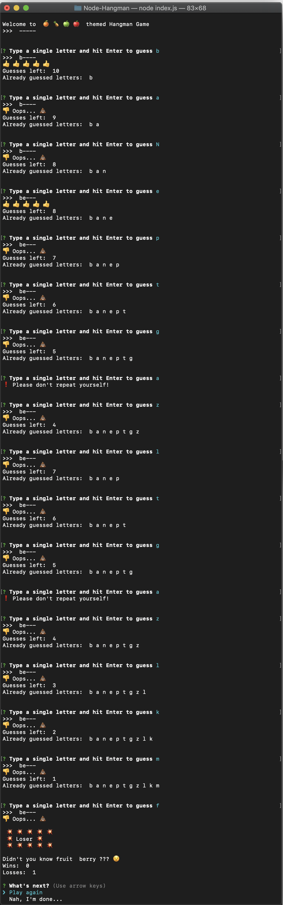

# Node-Hangman

_A you sure you can guess these fruits?_

Play this command line interface Hangman game to answer the question.

## Preconditions:

- You should have node on your machine

## Instructions:

1. Download this repo
1. Inside of directory run \$_npm i_ to install required node packages
1. Type \$_node index_ into the command line to start the challenge!
1. Enjoy the game!
1. Feel free to [contact me](https://www.linkedin.com/in/anastasiafefilova/) if you want to hire me ;) or just share your score.

## Exciting game features:

- User has 10 boo-boo's in each game
- You will see the list of already guessed letters
- If you still want to try to repeat input of one letter - you'll see error message
- At the end of each round you'll see:
  - either you won or lost
  - wins and losses count
  - if lost, you'll see the word
  - prompt to start a new game or finish

Enjoy fruits! Be happy!
